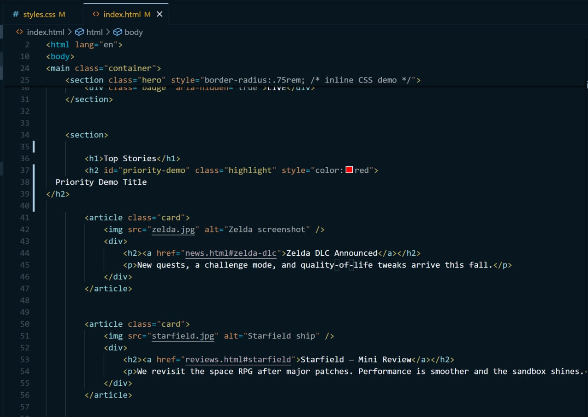
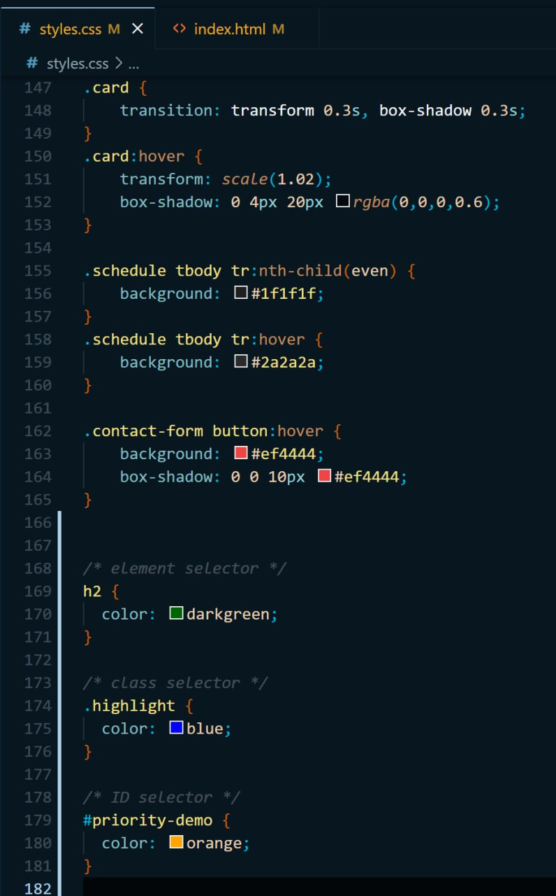
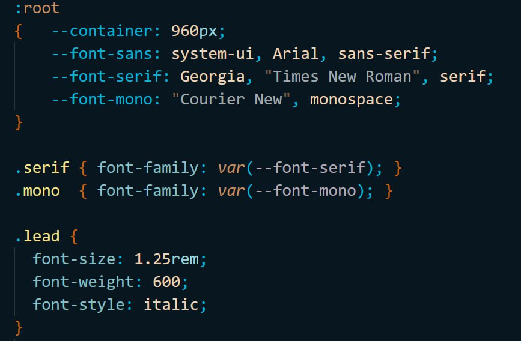
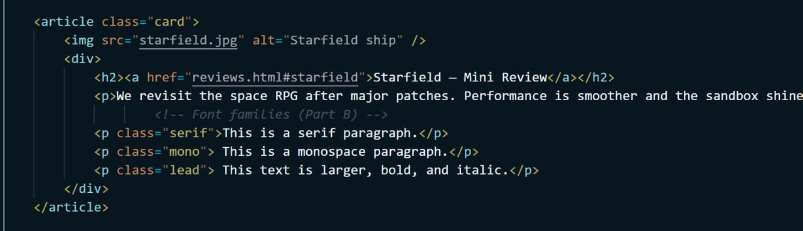
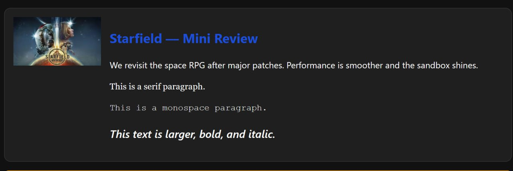
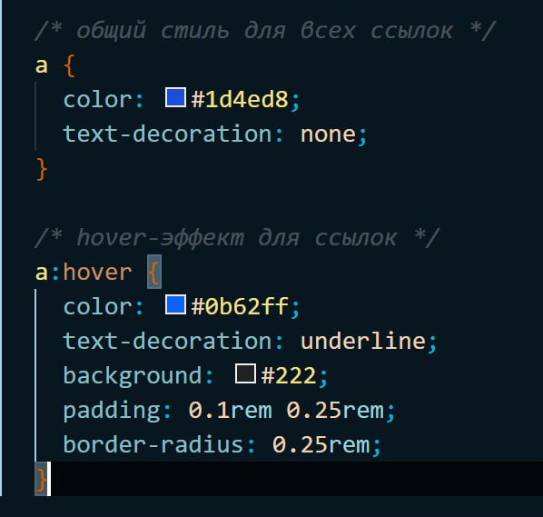
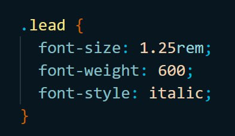

# Assignment 2 — CSS Fundamentals

## Part A — Selectors & Priority (Farkhad)

In this task I demonstrated the use of element, class, ID, and inline selectors, and proved their order of precedence.

I created a new heading in index.html:

<div align="center">
    
</div>

And in styles.css I added the following rules:

<div align="center">
    
</div>

Because of CSS specificity, the inline style has the highest priority, so the final color is red.
This confirms the rule: inline > ID > class > element.

<div align="center">
    
</div>

---

## Part B — Colors & Fonts (Farkhad)

#### 1. Fonts

The goal of this part was to demonstrate **text color, background color, hover color for links, and the use of different fonts, sizes, weights, and styles**.

In `styles.css` I defined three different font families (sans-serif, serif, and monospace):

<div align="center">
    
</div>

Then I applied them in index.html:

<div align="center">
    
</div>

Result: 
<div align="center">
    
</div>

#### 2. Link Styling

In styles.css I added global link styles:

<div align="center">
    
</div>

Result:

<div align="center">
    
</div>

#### 3. Text Styling

In styles.css I added "lead" class with some parameters:

<div align="center">
    
</div>

Then I applied them in index.html (last paragraph with class "lead"):

<div align="center">
    
</div>

Result: 
<div align="center">
    
</div>

---


## Part D — Classes & IDs Practical (semkair)

In this task I demonstrated the use of **classes and IDs** by adding a profile card to the contact page.

I created a **profile card** in `contact.html` before the contact form:

<div align="center">
    
</div>

```html
<div class="profile-card" id="author-card">
    
    <h2>Aibyn Samat</h2>
    <p>Student at AITU, passionate about game design and web development. Loves RPGs and exploring new technologies.</p>
</div>
```
And in styles.css I added the following rules:

```css

.profile-card {
    max-width: 300px;
    margin: 1.5rem 0;
    padding: 1rem;
    border: 2px solid #333;
    border-radius: 1rem;
    background: #1f1f1f;
    color: #fff;
    text-align: center;
    transition: border-color 0.3s, box-shadow 0.3s;
}
.profile-card img {
    width: 200px;
    height: 200px;
    object-fit: cover;
    border-radius: 50%;
    display: block;
    margin: 0 auto 1rem auto;
}
.profile-card:hover {
    border-color: #ef4444;
    box-shadow: 0 0 20px rgba(239,68,68,0.6);
}
#author-card {
    background: #222;
}
```
Because of CSS hover effects, when you move the mouse over the profile card, the border highlights in red and a shadow appears.

<div align="center">
    
</div>

Deployment

The project was deployed on GitHub Pages.
All pages are available online:
	•	index.html ✅
	•	news.html ✅
	•	reviews.html ✅
	•	contact.html ✅
